# 小学数学与奥数 - 学习顺序图

> 以下使用 Mermaid 语法展示知识点的学习顺序和依赖关系

```mermaid
flowchart TD
    %% 阶段一：数学启蒙
    A1[1 10以内数的认识] --> A2[2 10以内数的分成]
    A2 --> A3[3 10以内加减法]
    A1 --> A4[4 认识图形]
    A1 --> A5[5 位置与顺序]
    
    A1 --> A6[6 20以内数的认识]
    A3 --> A7[7 20以内进位加法]
    A6 --> A7
    A7 --> A8[8 20以内退位减法]
    A1 --> A9[9 认识钟表]
    A1 --> A10[10 分类与整理]

    %% 阶段二
    A6 --> A11[11 100以内数的认识]
    A8 --> A12[12 100以内加减法]
    A11 --> A12
    A3 --> A13[13 乘法意义理解]
    A13 --> A14[14 乘法口诀]
    A14 --> A15[15 表内乘法]
    A15 --> A16[16 表内除法]
    A16 --> A17[17 有余数除法]
    
    A4 --> A18[18 认识角]
    A4 --> A19[19 观察物体]
    A1 --> A20[20 长度单位]

    %% 阶段三
    A11 --> A21[21 千以内数]
    A21 --> A22[22 万以内数]
    A12 --> A23[23 万以内加减]
    A15 --> A24[24 两位数乘一位]
    A24 --> A25[25 两位数乘两位]
    A16 --> A26[26 三位数除一位]
    
    A1 --> A27[27 分数初步认识]
    A27 --> A28[28 分数大小比较]
    A27 --> A29[29 同分母分数加减]
    
    A4 --> A30[30 认识面积]
    A20 --> A31[31 面积单位]
    A30 --> A32[32 长方形正方形面积]

    %% 阶段四
    A22 --> A33[33 亿以内数]
    A33 --> A34[34 亿以上数]
    A25 --> A35[35 三位数乘两位]
    A35 --> A36[36 乘法运算定律]
    A26 --> A37[37 除数两位数除法]
    
    A4 --> A38[38 平行四边形]
    A18 --> A38
    A38 --> A39[39 梯形]
    A18 --> A40[40 三角形分类]
    A40 --> A41[41 三角形内角和]

    %% 阶段五
    A22 --> A42[42 小数意义性质]
    A27 --> A42
    A28 --> A43[43 小数大小比较]
    A42 --> A44[44 小数点移动]
    A23 --> A45[45 小数加减法]
    A35 --> A46[46 小数乘法]
    A37 --> A47[47 小数除法]
    
    A27 --> A48[48 分数意义性质]
    A42 --> A48
    A43 --> A49[49 分数小数互化]
    A48 --> A50[50 通分与约分]
    A28 --> A51[51 分数比较大小]
    
    A22 --> A52[52 折线统计图]
    A10 --> A53[53 可能性]

    %% 阶段六
    A48 --> A54[54 分数乘整数]
    A54 --> A55[55 分数乘分数]
    A55 --> A56[56 分数混合运算]
    A36 --> A56
    A56 --> A57[57 分数除法]
    A55 --> A58[58 倒数认识]
    
    A48 --> A59[59 百分数意义]
    A49 --> A60[60 百分数互化]
    A57 --> A61[61 百分数应用]

    %% 阶段七
    A48 --> A62[62 比的意义]
    A62 --> A63[63 比的基本性质]
    A50 --> A64[64 化简比]
    A63 --> A64
    A64 --> A65[65 按比例分配]
    A62 --> A66[66 比例意义性质]
    A63 --> A66
    A66 --> A67[67 解比例]
    A62 --> A68[68 正比例]
    A68 --> A69[69 反比例]
    A67 --> A70[70 比例尺]
    
    A4 --> A71[71 圆的认识]
    A71 --> A72[72 圆的周长]
    A20 --> A72
    A32 --> A73[73 圆的面积]
    A72 --> A73
    A73 --> A74[74 圆环面积]
    A71 --> A75[75 扇形认识]
    
    A71 --> A76[76 圆柱的认识]
    A76 --> A77[77 圆柱表面积]
    A73 --> A77
    A77 --> A78[78 圆柱体积]
    A76 --> A79[79 圆锥的认识]
    A78 --> A80[80 圆锥体积]
    A79 --> A80

    %% 奥数模块
    A12 --> O1[O1 加减法巧算]
    A23 --> O1
    A36 --> O2[O2 乘法分配律逆用]
    O1 --> O3[O3 基准数法]
    O2 --> O4[O4 变形约分]
    
    A50 --> O5[O5 异分母分数加减]
    A55 --> O6[O6 分数乘法巧算]
    O2 --> O6
    O5 --> O7[O7 裂项法]
    A50 --> O7
    A49 --> O8[O8 循环小数化分数]
    O7 --> O9[O9 繁分数化简]
    A57 --> O9
    
    A15 --> O10[O10 简单定义新运算]
    A16 --> O10
    O10 --> O11[O11 复杂定义新运算]
    A35 --> O11
    
    A1 --> O12[O12 整除概念]
    O12 --> O13[O13 整除判断]
    O13 --> O14[O14 余数定理]
    O14 --> O15[O15 同余问题]
    
    A1 --> O16[O16 质数与合数]
    O16 --> O17[O17 分解质因数]
    O17 --> O18[O18 质数筛法]
    O17 --> O19[O19 最大公因数]
    O19 --> O20[O20 最小公倍数]
    O20 --> O21[O21 三个数求LCM]
    
    A1 --> O22[O22 奇偶性性质]
    O22 --> O23[O23 奇偶性应用]
    
    A12 --> O24[O24 和差问题]
    A24 --> O25[O25 和倍问题]
    O25 --> O26[O26 差倍问题]
    O26 --> O27[O27 盈亏问题]
    
    A12 --> O28[O28 相遇问题]
    O28 --> O29[O29 追及问题]
    O29 --> O30[O30 环形跑道]
    O29 --> O31[O31 火车过桥]
    O31 --> O32[O32 流水行船]
    
    A12 --> O33[O33 植树问题]
    O24 --> O34[O34 年龄问题]
    O25 --> O34
    A16 --> O35[O35 鸡兔同笼]
    O24 --> O35
    O33 --> O36[O36 牛吃草问题]
    O27 --> O36
    
    A54 --> O37[O37 分数应用题]
    A55 --> O37
    O37 --> O38[O38 百分数应用]
    A60 --> O38
    O38 --> O39[O39 浓度问题]
    A50 --> O39
    O38 --> O40[O40 经济问题]
    
    A20 --> G1[G1 巧求周长]
    A32 --> G2[G2 巧求面积割补]
    G2 --> G3[G3 等积变形]
    A40 --> G3
    G3 --> G4[G4 鸟头定理]
    G4 --> G5[G5 蝴蝶定理]
    A73 --> G6[G6 圆与扇形面积]
    A75 --> G6
    
    A19 --> G7[G7 立体图形计数]
    A77 --> G8[G8 立体表面积]
    A78 --> G9[G9 立体体积]
    A80 --> G9
    G9 --> G10[G10 水中浸物]
    
    A10 --> C1[C1 枚举法]
    C1 --> C2[C2 分类枚举]
    C2 --> C3[C3 排列]
    A15 --> C3
    C3 --> C4[C4 组合]
    C2 --> C5[C5 加法原理]
    C5 --> C6[C6 乘法原理]
    C6 --> C7[C7 加乘综合]
    C4 --> C8[C8 排列组合综合]
    C7 --> C8
    C5 --> C9[C9 两量容斥]
    C9 --> C10[C10 三量容斥]
    
    A4 --> L1[L1 火柴棒游戏]
    A1 --> L2[L2 找规律填数]
    L2 --> L3[L3 找规律填图]
    L3 --> L4[L4 数独入门]
    A1 --> L5[L5 抽屉原理基础]
    L5 --> L6[L6 抽屉原理进阶]
    C1 --> L7[L7 简单逻辑推理]
    L7 --> L8[L8 列表推理]
    L8 --> L9[L9 假设法推理]
    L10 --> L11[L11 最优策略]
    L10 --> L12[L12 烙饼问题]
```



---

## 📊 知识体系统计

| 类别 | 数量 | 说明 |
|-----|:----:|------|
| 课内知识 | 80 | 覆盖1-6年级全部内容 |
| 奥数计算 | 11 | 速算、分数、定义新运算 |
| 奥数数论 | 12 | 整除、质数、奇偶性 |
| 奥数应用 | 17 | 行程、典型应用题 |
| 奥数几何 | 10 | 平面与立体几何 |
| 奥数计数 | 10 | 枚举、加乘、容斥 |
| 奥数组合 | 12 | 智巧、抽屉、逻辑、统筹 |
| **总计** | **~142** | 含课内+奥数 |

---

## 🎯 推荐学习路径

### 入门路径（1-2年级）
```
1→2→3→4→5→6→7→8→9→10→11→12→13→14→15→16→17→18→19→20
    → C1→L1→L2
```

### 基础路径（3-4年级）
```
21→22→23→24→25→26→27→28→29→30→31→32
→33→34→35→36→37→38→39→40→41
    → O1→O2→O3→O4
    → O12→O13→O14
    → O16→O17→O18
    → O22→O23
    → O24→O25→O26→O27
    → O28
    → O33→O34→O35
    → G1→G2
    → C1→C2→C3→C4→C5→C6
    → L3→L4
```

### 进阶路径（5-6年级）
```
42→43→44→45→46→47→48→49→50→51→52→53
→54→55→56→57→58→59→60→61
→62→63→64→65→66→67→68→69→70
→71→72→73→74→75→76→77→78→79→80
    → O5→O6→O7→O8→O9
    → O10→O11
    → O15
    → O19→O20→O21
    → O29→O30→O31→O32
    → O36
    → O37→O38→O39→O40
    → G3→G4→G5→G6
    → G7→G8→G9→G10
    → C7→C8→C9→C10
    → L5→L6→L7→L8→L9
    → L10→L11→L12
```

---

> 💡 使用说明：将此文件拖入 Obsidian 或使用 Mermaid 在线编辑器查看流程图